<!-- ============================================================ -->
<!--  HEADER  -->
<!-- ============================================================ -->

<div align="center">


<a href="https://git.io/typing-svg">
  
</a>

<br/><br/>

<a href="https://linkedin.com/in/amar-mohammed"></a>&nbsp;
<a href="mailto:amarmohammed398@gmail.com"></a>&nbsp;
<a href="https://github.com/amarmohammed398"></a>&nbsp;


</div>

<br/>

<!-- ============================================================ -->
<!--  ABOUT  -->
<!-- ============================================================ -->


```python
class Amar:
    def __init__(self):
        self.role       = "M.Sc. Artificial Intelligence @ University of Manchester"
        self.based_in   = "Manchester, UK"
        self.worked_at  = ["Barclays", "Thales UK", "Moropo", "MMU Research"]
        self.focus      = ["Knowledge Representation", "ML", "NLP", "Quantum ML"]
        self.currently  = "Master's project on advanced AI techniques"
```

AI M.Sc. student with a sandwich placement at **Thales UK** and a developer internship at **Barclays** — turning ideas into shipped systems. Built a Splunk dashboard handling **1.2M+ logons/day**, a Generative AI recognition-categoriser on OpenAI + Streamlit, and a **hybrid quantum-classical neural network** that identifies fish.

<br/>

<!-- ============================================================ -->
<!--  STACK  -->
<!-- ============================================================ -->


<table>
<tr>
<td valign="top" width="50%">

**Languages**


</td>
<td valign="top" width="50%">

**AI / ML**


</td>
</tr>
<tr>
<td valign="top" width="50%">

**Frameworks / Web**


</td>
<td valign="top" width="50%">

**Tools / Ops**


</td>
</tr>
</table>

<br/>

<!-- ============================================================ -->
<!--  PROJECTS  -->
<!-- ============================================================ -->


<table>
<tr>
<td width="100%">

### ⚛️ AquaQuantum — Quantum-Classical Fish Identifier
Mobile app identifying fish species via a **hybrid EfficientNet-B0 CNN + 4-qubit Quantum Neural Network** (PyTorch + PennyLane). Camera capture, geotagging, scan history, map visualisation and a stats dashboard in React Native (Expo), served by a FastAPI backend on Ubuntu — offline storage, privacy-first permissions.

`Python` `PyTorch` `PennyLane` `FastAPI` `React Native` `Quantum ML`

</td>
</tr>
<tr>
<td width="100%">

### 📈 Stocks Reminder App
Stock notification app for tracking prices and setting target alerts. Phase two: a Discord bot that buys/sells using the **Black-Scholes model**.

`Python` `Tkinter` `PowerShell` `REST APIs` `JSON/CSV`

</td>
</tr>
<tr>
<td width="100%">

### ⛓️ Ethereum To-Do List
A decentralised to-do app running on the Ethereum network — my gateway into blockchain development.

`Solidity` `Ganache` `ReactJS` `JavaScript`

</td>
</tr>
</table>

<br/>

<!-- ============================================================ -->
<!--  STATS  -->
<!-- ============================================================ -->


<div align="center">




<br/><br/>


</div>

<br/>

<!-- ============================================================ -->
<!--  FOOTER  -->
<!-- ============================================================ -->

<div align="center">


</div>
